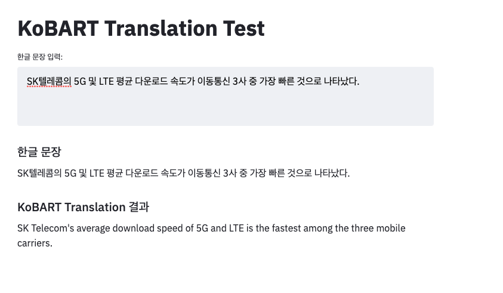

# KoBART-translation

## Install KoBART
```
git submodule update --init --recursive
cd KoBART
pip install -r requirements.txt
pip install .
```

## Requirements
```
pytorch==1.7.0
transformers==4.0.0
pytorch-lightning==1.1.0
streamlit==0.72.0
```
## Data
- [AI hub 전문분야 한-영 말뭉치](https://aihub.or.kr/aidata/7974) 의 학습 데이터를 활용함
- 학습 데이터에서 임의로 Train / Test 데이터를 생성함
- 기본 데이터 구조가 excel 형태인데 데이터 탐색에 용이하게 tsv 형태로 데이터를 변환함
- Data 구조
    - Train Data : 1,171,248
    - Test Data : 130,139
- data/train.tsv, data/test.tsv 가 기본 형태임
  
| kr  | en |
|-------|--------|
|나는 여전히 미국에서의 일정을 진행하고 있습니다.| I'm still proceeding with the schedule in America. |  
|우리가 대화한 내용을 누르면 해석이 됩니다.|If you touch our dialogue, it gets translated.|
|...|...|

## How to Train
- KoBART translation fine-tuning
```
./prepare.sh
pip install -r requirements.txt
python train.py  --gradient_clip_val 1.0 --max_epochs 50 --default_root_dir logs  --gpus 1 --batch_size 4
```
## Translation Sample (Test 데이터 기준)
- 화장실은 매우 더럽고 화장지가 배치되어 있지 않아 사용하기 불편해요.

| ||Text|
|-------|:--------|:--------|
|1|Label|Bathroom is really dirty and there is no toilet paper so it's very uncomfortable to use it.|
|2|Google Translation|The toilet is very dirty and it is inconvenient to use it because there is no toilet paper.|
|2|koBART|The toilet is very dirty and there are no toilet papers, making it inconvenient to use.|

- 경찰에 따르면 한때 4000원대였던 네이처셀 주가는 최대 6만2200원까지 급등했지만 지난 3월 식약처가 조인트스템의 조건부 허가 신청을 반려하자 주가는 크게 하락했다.

| ||Text|
|-------|:--------|:--------|
|1|Label|According to the police, shares of Nature Cell jumped to 62,200 won, once in the 4,000 won range, but their shares fell sharply in March after the Ministry of Food and Drug Safety rejected the request for conditional permission from Jointstem|
|2|Google Translation|According to the police, the stock price of Nature Cell, which was once in the 4,000 won range, soared to a maximum of 62,200 won, but the stock price fell sharply after the Ministry of Food and Drug Safety rejected JointStem's conditional permit application in March.|
|2|koBART|According to the police, shares of Nature Cell, which were once around 4,000 won, jumped to up to 62,200 won, but shares fell sharply in March when the Ministry of Food and Drug Safety rejected the conditional licensing application of Joint System.|

- 경제가 살아난 미국이 올 들어 벌써 3번째 기준금리를 올리면서 우리 경제에 어떤 영향을 미칠지 걱정이 큽니다.

| ||Text|
|-------|:--------|:--------|
|1|Label|It is concerned a lot that the U.S. whose economy has been revived has raised its benchmark interest rate for the third time this year already and how it will be impacted on our economy.|
|2|Google Translation|I am very worried about the impact of the US economy, which has risen, will affect our economy as it has already raised its third benchmark interest rate this year.|
|2|koBART|The U.S., whose economy has been revived, is already worried about how it will affect our economy as it has raised its third key interest rate this year.|

- 오늘 친구들을 만나서 토픽에 대해서 자세히 알아봐야겠어!

| ||Text|
|-------|:--------|:--------|
|1|Label|I'd better ask more specifically about the topic when I meet with my friends today.|
|2|Google Translation|I need to meet my friends today and learn more about the topic!|
|2|koBART|We should meet our friends today to find out about the topic in detail!|

## Model Performance
- Test Data에서 임의의 10,000개 데이터를 추출하여 BLEU Score를 산출함
  
|BLEU|
|-------:|
|32.85|

## Demo
- 학습한 model binary 추출 작업이 필요함
   - pytorch-lightning binary --> huggingface binary로 추출 작업 필요
   - hparams의 경우에는 <b>./logs/tb_logs/default/version_0/hparams.yaml</b> 파일을 활용
   - model_binary 의 경우에는 <b>./logs/kobart_translation-model_chp</b> 안에 있는 .ckpt 파일을 활용
   - 변환 코드를 실행하면 <b>./translation_binary</b> 에 model binary 가 추출 됨
  
```
 python get_model_binary.py --hparams hparam_path -- model_binary model_binary_path
```

- streamlit을 활용하여 Demo 실행
    - 실행 시 <b>http://localhost:8501/</b> 로 Demo page가 실행됨
```
streamlit run infer.py
```

- Demo Page 실행 결과
  - [원문링크](http://www.bloter.net/archives/499096)
  


## Reference
- [KoBART](https://github.com/SKT-AI/KoBART)
- [KoBART-chatbot](https://github.com/haven-jeon/KoBART-chatbot)